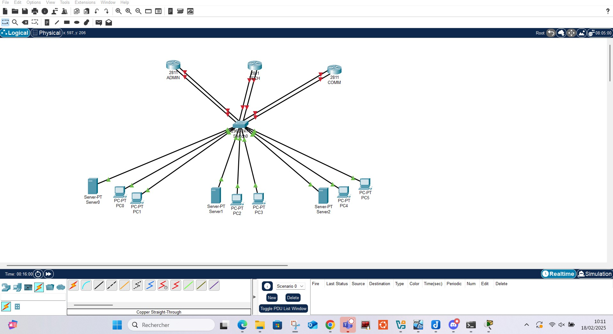

# Evaluation du 18 février 2025
# Réseau TCP/IP UDP

## 1. Introduction
**Le but général de cette évaluation et des concepts abordés (TCP/IP,
routage, transport, protocoles complémentaires comme DHCP et ARP) est** l'analyse et la compréhentsion des fondamentaux de la communication et l'échange de données sur un réseau informatique. Les concepts abordés permettent de comprendre comment les  réseaux interagissent entre eux, pour assurer une communication rapide et efficace.

**TCP/IP** (Transmission Control Protocol / Internet Protocol) :

**TCP/IP** est un ensemble de protocoles de communication qui définissent la manière dont les données circulent sur un réseau. TCP est responsable de la transmission sûre des données, et IP se charge du routage des paquets à travers différents réseaux. Ensemble, ils forment la base des communications sur internet 

**Le Routage** concerne la manière dont les paquets et les trames sont envoyés d'un appareil à  un autre à travers différents réseaux. Les routeurs sont responsables de cette tâche, en définissant le meilleur chemin pour que les données arrivent à destination.

**Le Transport** assure comment les données sont segmentées et transmises entre les applications sur des ordinateurs distants. TCP est utilisé pour des transmissions fiables, tandis qu'UDP est plus rapide mais sans garantie de réception des données.
Protocoles complémentaires :

**DHCP** : c'est le protocole qui attribue aux appareils d'un réseau, automatiquement, une adresse IP, ce qui facilite leur configuration et organisation sans intervention manuelle.

**ARP**  le protocole ARP est utilisé pour associer une adresse IP à une adresse MAC dans un réseau local, afin de permettre une communication effective et sûre sur  un réseau local (LAN).

L'évaluation permet de comprendre les bases techniques des réseaux et leur fonctionnement, en abordant les protocoles, la gestion des adresses, le transport des données et leur routage. Cela sert à bien appréhender le processus complet d'échange d'informations à travers un réseau informatique.

## 2. Liste des manipulations réalisées  
Décrivez chaque exercice, incluant : 

### 1- Les commandes utilisées (exemple : configura on d'une adresse IP, simula on d'un routage dynamique). 

**1- Insertion de :**
    - Trois *routeurs* : ADMIN - TECH - COMM
	- Un *switch* et trois *serveurs*
	- Six ordinateurs *PC*
	
**2- Cablage et connexion physique:** connexion du matériel inséré avec le cable *copper straight through* 

**3- Configuration des interfaces réseaux**
Dans cette étape, nous allons procéder à la configuration des routeurs, Pc et serveurs. 

- Routeur Admin :
  *Interface FastEthernet 0/0* :
   IP de configuration : 192.168.1.1
   Masque de sous-réseau : 255.255.255.0

  *Interface FastEthernet 0/1* :
   IP de configuration : 10.0.0.1
   Masque de sous-réseau : 255.255.255.0

Voir prise d'écran suivantes : 
Routeur Admin 

 *Interface FastEthernet 0/0* 

 *Interface FastEthernet 0/1* 

- Routeur Tech :
  *Interface FastEthernet 0/0* :
   IP de configuration : 192.168.2.1
   Masque de sous-réseau : 255.255.255.0

  *Interface FastEthernet 0/1* :
   IP de configuration : 10.0.0.2
   Masque de sous-réseau : 255.255.255.0

  *Interface FastEthernet 0/0* :

  *Interface FastEthernet 0/1* :

- Routeur Comm :
  *Interface FastEthernet 0/0* :
   IP de configuration : 192.168.3.1
   Masque de sous-réseau : 255.255.255.0

  *Interface FastEthernet 0/1* :
   IP de configuration : 10.0.0.3
   Masque de sous-réseau : 255.255.255.0

*Interface FastEthernet 0/0* :

*Interface FastEthernet 0/1* :

**3-Activation  et sauvegarde de la configuration de chaque interface réseau** avec 
 **Activation** : *no shutdown*
 **Sauvegarde** : *write memory*

**4- Ajout des routes:**

- *a -Route Admin*

- *b -Route Tech*

- *c -Route Comm*

**5- Configuration des Serveurs et Ordinateurs (PC):**

- Serveurs :
  1. Serveur Admin :
Passerelle serveur:

FastEthernet0 

  2. Serveur Tech: pereil pour le serveur **TECH**
*La passerelle est : 192.168.2.10*
*Le serveur DNS est : 8.8.8.8*

  3. Serveur Comm: pour le serveur **COMM**
*La passerelle est : 192.168.3.10*
*Le serveur DNS est : 8.8.8.8*

- Ordinateurs (PC):
   1. PC Admin:
 Pc1 Admin:

Pc2 Admin: 
*IP : 192.168.1.200*
*Passerelle: 192.168.1.1*
*Adresse DNS: 8.8.8.8*

   3. PC Tech:
 Pc1 Tech:

 Pc2 Tech:
*IP : 192.168.2.200*
*Passerelle: 192.168.2.1*
*Adresse DNS: 8.8.8.8*
  
   5. PC Comm:
Pc1 Comm:

Pc2 Comm: 
*IP : 192.168.3.200*
*Passerelle: 192.168.3.1*
*Adresse DNS: 8.8.8.8*

### 2-  Le contexte (tests de connectivité, configuration de DHCP). 

**Test de connectivité dans chaque sous-réseau**
1. Sous-réseau Admin:
   *Réalisation d'un ping vers l'IP 192.168.1.200 depuis le PC1-Admin*

   *Réalisation d'un ping vers la Passerelle 192.168.1.100 depuis le PC2-Admin*

3. Sous-réseau Tech:
   *Réalisation d'un ping vers l'IP 192.168.2.200 depuis le PC1-Tech*

   *Réalisation d'un ping vers la Passerelle 192.168.2.100 depuis le PC2-Tech*

5. Sous-réseau Comm:
   *Réalisation d'un ping vers l'IP 192.168.3.200 depuis le PC1-Comm*

   *Réalisation d'un ping vers la Passerelle 192.168.3.100 depuis le PC2-Comm*

**Test de connectivité entre les sous-réseaux**

*Ping Admin vers Tech* ping 192.168.1.100 vers 192.168.2.200

*Ping Admin vers Comm* ping 192.168.1.200 vers 192.168.2.100

*Ping Tech vers Admin* ping 192.168.2.100 vers 192.168.1.200

*Ping Tech vers Comm* ping 192.168.2.200 vers 192.168.3.100

**_Observation: le ping n'a pas marché_** : Ce test de connectivité n'a pas marché parce qu'une des interfaces réseaux du routeur **Comm** n'est pas activée

** A la suite de l'activation de la carte réseau FastEthernet0/1: le ping à marché**
Voir la capture d'écran suivante:

*Ping Comm vers Admin* ping 192.168.3.100 vers 192.168.1.200

*Ping Comm vers Tech* ping 192.168.3.200 vers 192.168.2.200

*Les test de connectivité entre les départements ont tous été effectué avec succés*

### Réalisation de ping en filtrant le protocole TCP :
1. Selection du protocole TCP :

2. Réalisation d'un ping depuis un des PC du réseau:

Tous les paquets ont été transmis (aucun n'a été perdu)

### Réalisation de ping en filtrant le protocole UDP:
1. Selection du protocole UDP:

2. Réalisation d'un ping depuis un des PC du réseau:

Tous les paquets ont été transmis *mais il se pourrait qu'il y est des pertes* parce que le protocole UDP ne vérifie pas l'arrivée des paquets. Lors d'une vision d'une vidéo par exemple, la vidéo. Le serveur continue d'envoyer du contenu malgré la rupture de la transmission

*Résultat du ping lors de la selection du port UDP*

### Vértification de la connectivité avec ICMP 
1. Réalisation d'un ping depuis Admin vers le routeur ADMIN

2. Réalisation d'un ping depuis Tech vers le routeur TECH

3. Réalisation d'un ping depuis Comm vers le routeur COMM

**Les connexions entre les PC et les routeurs de chaque sous-réseau sont bien établies et fonctionnent parfaitement sans aucune perte de paquet**

### 3- Les résultats attendus après chaque manipulation. 

Les résultats attendus entre chaque manipulation sont visibles dans chaque manipulation effectuée. 
1. La bonne configuration de chaque élément.
2. La connectivité entre les PC de chaque sous-réseau.
3. La connectivité entre les PC des différents département. 

## 3. Problèmes rencontrés et solutions 

J'ai rencontré un problème de connectivité lors du ping 192.168.3.100 depuis le **PC TECH2** à cause de la non activation de l'interface FastEthernet0/1 du routeur **COMM.

Voir photo :

Le ping avait bien fonctionné lorsque l'activation de cette interface réseau a été effectuée avec la commande `no shutdown` puis `write memory` après deux `exit`

## 4. Analyse théorique 

### 1- Explication de l'importance des protocoles TCP/IP dans les réseaux modernes: 

les protocoles TCP/IP sont très important dans Internet et des réseaux modernes. Ils assurent la communication fiable grâce à TCP, le routage et l'adressage avec IP et l'interopérabilité entre différents types de réseaux et dispositifs.Ils nous assurent aussi la fléxibilité pour s'adapter à des millions de nouveaux appareils et services.

*Sans TCP/IP, le réseau global tel que nous le connaissons aujourd'hui ne serait pas possible.*

**L'avantage des protocoles TCP/IP** est la fiabilité et le contrôle des flux pour assurer la garantie des livraisons de l'ensemble des paquets envoyés.  il est utilisé pour des transmissions fiables, comme l'envoi des fichiers, l'envoi des e-mails...

** L'avantage des protocoles UDP** est la transmission directe et sans interruption des données qui sont lègères. Il est utilisé dans la vidéo, le streaming et les jeux vidéos parcequ'il a une faible latence. 

## 5. Conclusion 
Les protocoles TCP/IP sont essentiels pour la connectivité réseau moderne, en offrant  Une communication fiable et efficace (avec TCP pour la fiabilité et UDP pour la rapidité),
Un routage précis et un adressage unique à l'échelle mondiale (grâce à IP) ainsi que la possibilité d'interconnecter des réseaux divers.

TCP/IP est à la base de l'infrastructure d'Internet et des réseaux modernes, facilitant les échanges de données entre des systèmes variés à travers le monde.

## 6. Ressources 
ChatGPT.com et documentation 

## Quizz

**1. La principale différence entre TCP et UDP est :**

_A. TCP garantit la fiabilité, UDP est plus rapide._

**2. La couche du modèle TCP/IP qui gère le routage des paquets est :** la couche Internet

**3. Le protocole est utilisé pour résoudre une adresse IP en adresse MAC est :**  _ARP_

**4. La taille d'une adresse IPv6 est** _128 bits_ 

**5. L'outil qui permet d’analyser les performances d’un réseau en capturant les paquets est:**    _Wireshark_ 

